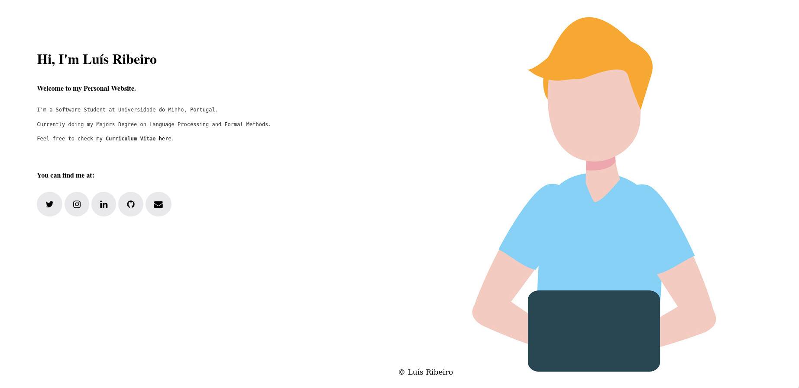

## Personal Website

Hi, I'm Luís Mário Macedo Ribeiro. 

I'm a Software Student at Universidade do Minho, Portugal. Currently doing my Majors Degree on Language Processing and Formal Methods.

My [Portfolio](https://luis1ribeiro.github.io/) is allocated in this repository through the use of *GitHub Pages* extension. There, you can find all my personal info, alongside with my ***Curriculum Vitae***.

Go ahead and check it! (ง ͠° ͟ل͜ ͡°)ง

   

